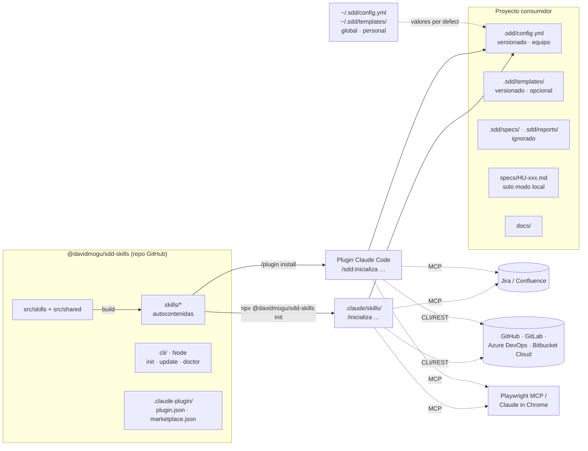
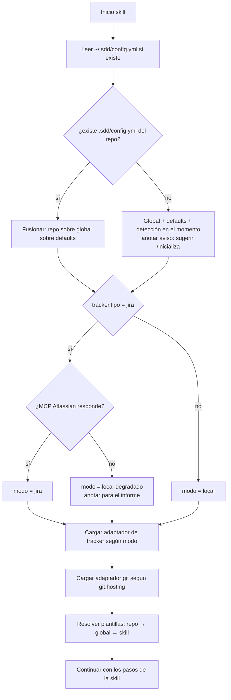
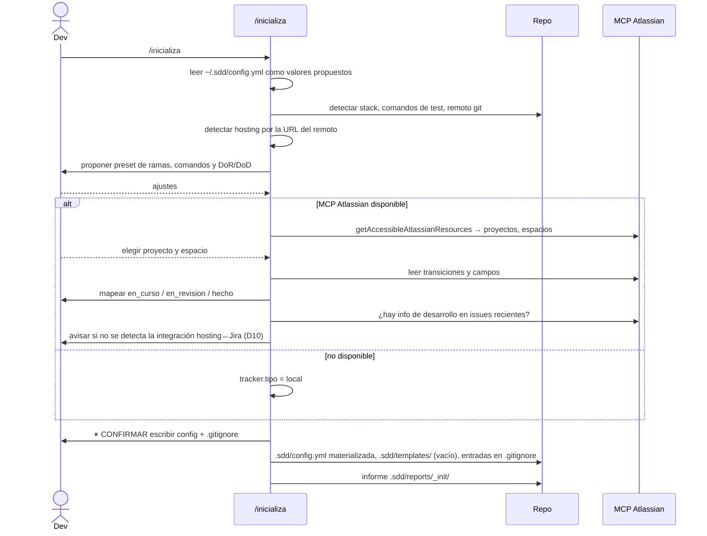
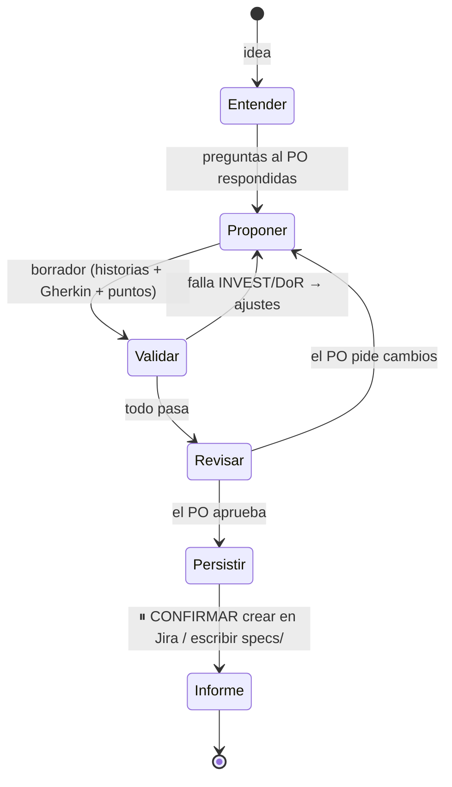
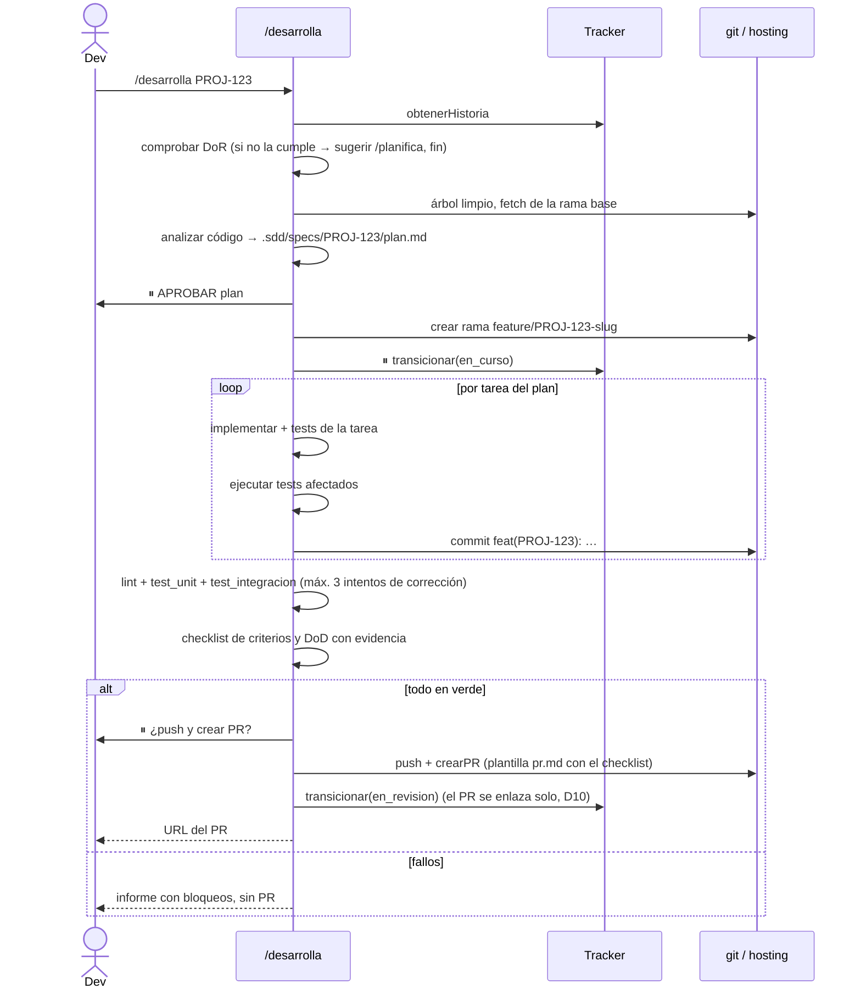
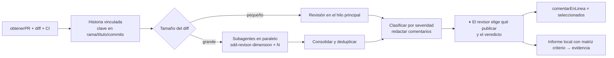
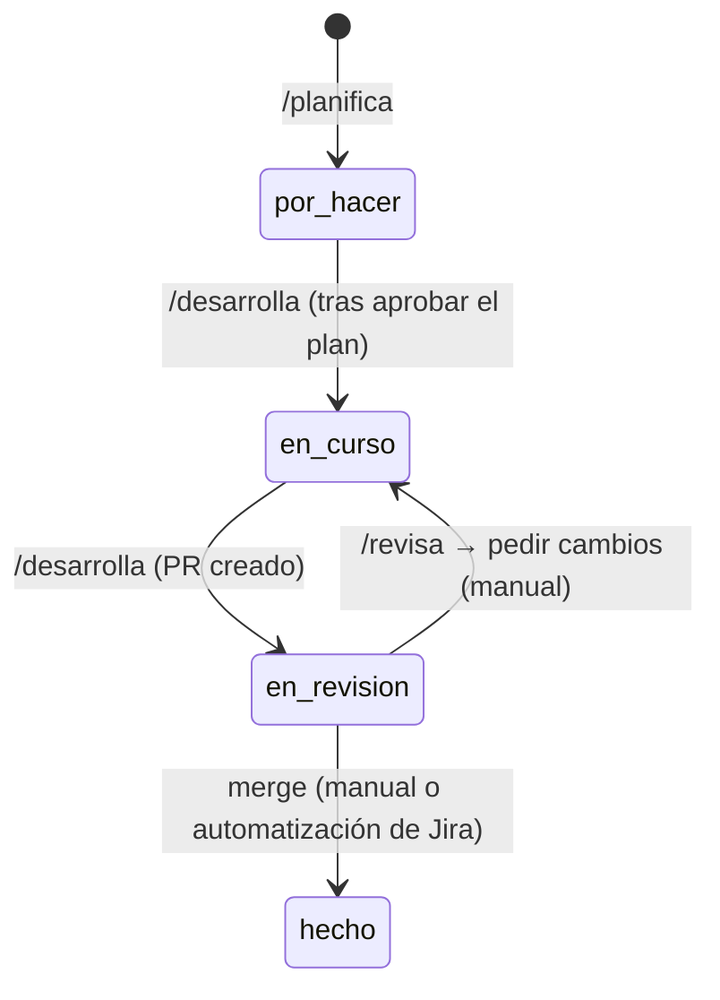

# SDD Skills — Diseño de arquitectura

> `/sc:design` · 2026-10-02 · Basado en [`requisitos.md`](./requisitos.md)
> Estado: puntos abiertos resueltos (§13), pendiente de aprobación · Siguiente paso: `/sc:workflow` o `/sc:implement`

## 1. Principios de diseño

| # | Principio | Consecuencia |
|---|---|---|
| P1 | **Prompt-first, sin runtime propio** | Las skills son Markdown. La lógica determinista se resuelve con CLIs ya existentes (`git`, `gh`, `glab`, `az`, `curl`) y con el MCP de Atlassian. El plugin no exige Node, Python ni binarios propios (RNF-1). |
| P2 | **Skills autocontenidas** | Cada carpeta de skill lleva todo lo que necesita. Lo compartido se escribe una sola vez en `src/shared/` y un *build* lo copia en cada skill. |
| P3 | **Adaptadores como recetas** | El tracker (Jira o local) y el hosting Git (4 plataformas) se abstraen con un **contrato de operaciones** y una receta Markdown por implementación. La skill solo carga la receta que corresponde al proyecto (RNF-7). |
| P4 | **Configuración como única fuente de decisiones** | Todo lo que varía entre proyectos vive en la configuración, en dos niveles: **repo** (`.sdd/config.yml`, compartido con el equipo) sobre **global** (`~/.sdd/config.yml`, personal). Las skills no adivinan nada que pueda estar configurado (§5). |
| P5 | **Puntos de confirmación explícitos** | Cada efecto externo (Jira, PR, Confluence, push) es un paso marcado `⏸ CONFIRMAR` en el `SKILL.md` (RF-T7). |
| P6 | **Plantillas sobrescribibles** | Se resuelve `.sdd/templates/<x>.md` del repo → `~/.sdd/templates/<x>.md` global → plantilla de la skill (RF-T9). |

## 2. Vista general



## 3. Estructura del repositorio

```
sdd-skills/
├── .claude-plugin/
│   ├── plugin.json              # name: "sdd", version (sincronizada con package.json)
│   └── marketplace.json         # marketplace de un solo plugin, source: "./"
├── package.json                 # @davidmogu/sdd-skills · bin: sdd · publishConfig → GitHub Packages
├── src/                         # ← FUENTE (se edita aquí)
│   ├── shared/
│   │   ├── contratos/
│   │   │   ├── tracker.md       # operaciones del tracker (contrato)
│   │   │   └── git-host.md      # operaciones del hosting (contrato)
│   │   ├── adaptadores/
│   │   │   ├── tracker-jira.md
│   │   │   ├── tracker-local.md
│   │   │   ├── git-github.md
│   │   │   ├── git-gitlab.md
│   │   │   ├── git-azure.md
│   │   │   └── git-bitbucket-cloud.md
│   │   ├── convenciones/
│   │   │   ├── ramas.md         # presets gitflow · github-flow · trunk
│   │   │   ├── commits.md       # Conventional Commits + clave en scope
│   │   │   └── dor-dod.md       # DoR/DoD estándar
│   │   ├── protocolo-comun.md   # arranque común: leer config, detectar modo, resolver plantillas
│   │   └── informe.md           # formato común de informe
│   └── skills/
│       ├── inicializa/
│       │   ├── SKILL.md
│       │   ├── shared.txt       # qué ficheros de src/shared/ incluir en esta skill
│       │   ├── referencias/deteccion-stack.md
│       │   └── plantillas/config.yml
│       ├── planifica/
│       │   ├── SKILL.md · shared.txt
│       │   ├── referencias/{invest.md, gherkin.md, estimacion.md, ejemplos.md}
│       │   └── plantillas/{historia.md, epica.md}
│       ├── desarrolla/
│       │   ├── SKILL.md · shared.txt
│       │   ├── referencias/{plan-tecnico.md, checklist-cierre.md}
│       │   └── plantillas/{plan.md, pr.md}
│       ├── revisa/
│       │   ├── SKILL.md · shared.txt
│       │   ├── referencias/{checklist-revision.md, severidades.md, tono-comentarios.md}
│       │   └── plantillas/comentario.md
│       ├── prueba/
│       │   ├── SKILL.md · shared.txt
│       │   ├── referencias/{exploratoria-mcp.md, playwright-generacion.md}
│       │   └── plantillas/{caso-e2e.md, bug.md}
│       └── documenta/
│           ├── SKILL.md · shared.txt
│           ├── referencias/{mapa-documental.md, confluence.md}
│           └── plantillas/{doc-tecnica.md, adr.md, changelog.md}
├── skills/                      # ← GENERADO por build (commiteado: el plugin se instala desde git)
├── agents/
│   └── sdd-revisor-dimension.md # subagente para la revisión paralela (§8.4)
├── cli/
│   ├── index.mjs                # init · update · doctor
│   └── schema/config.schema.json
├── scripts/
│   ├── build.mjs                # src → skills (copia shared según shared.txt)
│   └── release.mjs              # sincroniza versiones plugin.json ↔ package.json
├── evals/                       # suite de evaluación por skill + repos de ejemplo
├── docs/                        # requisitos, diseño, guía de uso
├── CHANGELOG.md
└── .github/workflows/{ci.yml, release.yml}
```

**Por qué `skills/` generado y commiteado:** el marketplace instala el plugin clonando el repo, sin ejecutar ningún *build*, así que las skills ya tienen que estar completas en git. La CI comprueba que `skills/` coincide con lo que produce `build` a partir de `src/` (si alguien edita `skills/` a mano, la CI falla).

## 4. Distribución e invocación

| Canal | Instalación | Invocación | Actualización | Requisito |
|---|---|---|---|---|
| **Plugin** | `/plugin marketplace add davidmogu/sdd-skills` → `/plugin install sdd@sdd-skills --scope user\|project` | `/inicializa` (o `/sdd:inicializa` si hay conflicto) | `/plugin marketplace update` | Ninguno |
| **npm** | `npm i -D @davidmogu/sdd-skills` → `npx sdd init [--global]` | `/inicializa`, `/planifica`… | `npx sdd update [--global]` | Node + `.npmrc` hacia GitHub Packages |

**Alcance de la instalación (D12):**

| Alcance | Plugin | npm | Quién lo ve |
|---|---|---|---|
| **Global** (usuario) | `--scope user` (por defecto) | `npx sdd init --global` → `~/.claude/skills/` | Tú, en todos tus proyectos |
| **Repo** (equipo) | `--scope project` → queda en `.claude/settings.json` versionado | `npx sdd init` → `.claude/skills/` del repo | Todo el que clone el repo |

Para equipos se recomienda el **alcance repo**: quien clone el repo recibe las skills sin instalar nada a mano (con el plugin, Claude Code le propone instalarlo).

> **Decisión D8 (revisada tras el [spike F0](./spike-f0.md)):** el nombre corto (`/planifica`) funciona en **los dos canales**; con el plugin se resuelve a `sdd:planifica` cuando no hay conflicto. La guía documenta `/planifica` como forma principal y `/sdd:planifica` como forma explícita para resolver conflictos. No hace falta ningún alias.

**CLI npm (`cli/index.mjs`):**
- `init [--global]`: copia `skills/*` a `.claude/skills/` (o a `~/.claude/skills/` con `--global`) y escribe `.sdd-manifest.json` en ese destino con la versión y un hash por fichero. No crea configuración: eso lo hace `/inicializa`.
- `update [--global]`: compara cada fichero con su hash del manifiesto. Los ficheros que el usuario no ha tocado se reemplazan; los modificados se dejan intactos y se avisa (RNF-3). Las personalizaciones deben ir en `.sdd/templates/` o `~/.sdd/templates/`.
- `doctor`: valida la config global y la del repo contra el JSON Schema, muestra la **config efectiva** indicando de qué nivel sale cada clave, avisa si las skills están instaladas varias veces (plugin + npm, o global + repo), y comprueba las CLIs y variables de entorno. También avisa si la versión instalada de una CLI (`gh`, `glab`, `az`) es **inferior a la mínima probada**, que se declara en `cli/versiones-minimas.json` y se actualiza en cada release (D11).

## 5. Modelo de configuración

### 5.1 Niveles y precedencia (D12)

| Prioridad | Nivel | Fichero | Versionado | Para qué |
|---|---|---|---|---|
| 1 (manda) | **Repo** | `<repo>/.sdd/config.yml` | Sí, compartido con el equipo | Todo lo específico del proyecto |
| 2 | **Global** | `$SDD_HOME/config.yml` (por defecto `~/.sdd/config.yml`) | No, personal | Valores por defecto de la org o personales: sitio Jira (`cloudId`), preset de ramas, DoR/DoD, Confluence, idioma |
| 3 | **Paquete** | valores por defecto incluidos en las skills | — | Lo mínimo para funcionar |

**Reglas de fusión:**
- Los mapas se fusionan en profundidad, clave a clave.
- Las listas (`dor`, `dod`, `git.ramas.tipos`) **se reemplazan enteras**, no se concatenan.
- `null` en el repo anula explícitamente un valor global.

**Claves solo de repo:** `git.repo`, `git.hosting`, `comandos.*`, `e2e.url_base`, `e2e.ruta_tests`, `tracker.jira.proyecto`, `tracker.jira.estados` y `rutas.*`. Si aparecen en la global, `doctor` avisa y las skills las ignoran, porque dependen del repo concreto.

**Repo sin `.sdd/config.yml`:**
- Las skills funcionan con la global más los valores por defecto del paquete.
- Lo que depende del repo (hosting por la URL del remoto, comandos de test) se detecta en el momento.
- El informe avisa: *"config del repo no encontrada; ejecuta `/inicializa` para fijarla y compartirla con el equipo"*.
- Excepción: con `tracker.tipo: jira` hace falta `tracker.jira.proyecto`. Si no se sabe, se pregunta una vez y se sugiere `/inicializa`.

**La config del repo se escribe materializada.** `/inicializa` usa la global solo como **valores propuestos** y escribe en el repo una config **completa**, sin referencias a la global. Si no, un compañero sin tu `~/.sdd/config.yml` obtendría otro comportamiento.

### 5.2 Esquema (`.sdd/config.yml` del repo)

```yaml
version: 1
idioma: es

tracker:
  tipo: jira                    # jira | local
  jira:
    cloudId: "…"
    proyecto: PROJ
    tipos: { epica: Epic, historia: Story, bug: Bug }
    estados:                    # mapeo creado en /inicializa (RF-I3)
      en_curso:    { transicion: "21", nombre: "In Progress" }
      en_revision: { transicion: "31", nombre: "Code Review" }
      hecho:       { transicion: "41", nombre: "Done" }
    campos:
      story_points: customfield_10016   # null si no existe
  local:
    prefijo: HU
    ruta: specs/

confluence:                     # opcional
  espacio: DEV
  pagina_padre: "123456"

git:
  hosting: github               # github | gitlab | azure | bitbucket-cloud
  remoto: origin
  repo: org/proyecto            # o workspace/repo · org/proyecto/repo (azure)
  ramas:
    preset: gitflow             # gitflow | github-flow | trunk
    base: develop               # derivado del preset, sobrescribible
    patron: "{tipo}/{clave}-{slug}"
    tipos: [feature, bugfix, hotfix, chore]
  commits:
    patron: "{tipo}({clave}): {descripcion}"

comandos:                       # detectados en /inicializa (RF-I1)
  lint: "npm run lint"
  test_unit: "npm test"
  test_integracion: "npm run test:int"
  test_e2e: "npx playwright test"

e2e:
  url_base: "http://localhost:3000"
  ruta_tests: e2e/
  navegador_mcp: auto           # auto | playwright | claude-in-chrome

rutas:
  docs: docs/
  specs_locales: .sdd/specs/    # ignorado por git
  informes: .sdd/reports/       # ignorado por git
  plantillas: .sdd/templates/   # además de ~/.sdd/templates/ (P6)

dor: [ … ]                      # copiada del estándar en /inicializa, editable
dod: [ … ]
```

- **Secretos fuera de los dos ficheros** (RNF-4): las credenciales de Bitbucket van en `BITBUCKET_EMAIL` y `BITBUCKET_API_TOKEN`; las demás plataformas usan la autenticación de su CLI (`gh auth`, `glab auth`, `az login`) y Atlassian la del MCP.
- **Esquema:** `cli/schema/config.schema.json` (válido para los dos niveles, todas las claves opcionales en la global) lo usa `doctor`. Las skills validan por su cuenta las claves que necesitan (P1).
- **Versionado de la config:** `version: 1`. Si una versión del paquete cambia el formato, `/inicializa` migra la config al volver a ejecutarse.

## 6. Contratos de los adaptadores

### 6.1 Tracker (`contratos/tracker.md`)

| Operación | Jira (MCP Atlassian) | Local (`specs/`) |
|---|---|---|
| `obtenerHistoria(id)` | `getJiraIssue` | leer `specs/<id>.md` |
| `buscarHistorias(filtro)` | `searchJiraIssuesUsingJql` | listar el frontmatter de `specs/*.md` |
| `crearEpica / crearHistoria(datos)` | `createJiraIssue` | escribir el fichero con el siguiente ID libre |
| `actualizarHistoria(id, datos)` | `editJiraIssue` | reescribir el fichero |
| `transicionar(id, estado_logico)` | `transitionJiraIssue` con `config.estados` | cambiar `estado:` en el frontmatter |
| `vincular(id, url, tipo)` | **no-op**: confía en la integración del hosting con Jira (D10) | añadir a `enlaces:` |
| `crearBug(datos, historia)` | `createJiraIssue` + enlace | `specs/BUG-xxx.md` |

Por diseño, el contrato **no incluye "comentar"**: ningún informe se publica en Jira (RF-T5).

**Vinculación con Jira (D10):** la rama, los commits y el título del PR siempre llevan la clave de la historia. Con la integración del hosting activa (GitHub for Jira, Bitbucket, GitLab for Jira o Azure DevOps for Jira), el PR aparece solo en el panel *Desarrollo* de la issue. La skill no escribe enlaces en Jira.

**Formato de una historia local:**

```markdown
---
id: HU-007
tipo: historia
titulo: Filtrar pedidos por fecha
estado: por_hacer        # por_hacer | en_curso | en_revision | hecho
puntos: 3
epica: HU-002
dependencias: []
enlaces: []
dor: { cumple: true, puntuacion_invest: 5/6 }
---
**Como** responsable de almacén **quiero** filtrar pedidos por fecha **para** preparar los envíos del día.

## Criterios de aceptación
```gherkin
Escenario: Filtro por rango válido
  Dado …
```
## Notas
```

### 6.2 Hosting Git (`contratos/git-host.md`)

| Operación | GitHub | GitLab | Azure DevOps | Bitbucket Cloud |
|---|---|---|---|---|
| `crearPR` | `gh pr create` | `glab mr create` | `az repos pr create` | `POST /2.0/repositories/{ws}/{repo}/pullrequests` |
| `obtenerPR` | `gh pr view --json` | `glab mr view -F json` | `az repos pr show` | `GET …/pullrequests/{id}` |
| `obtenerDiff` | `gh pr diff` | `glab mr diff` | `git diff` entre ramas tras hacer fetch | `GET …/pullrequests/{id}/diff` |
| `listarComentarios` | `gh api …/comments` | `glab api …/notes` | `az devops invoke --area git --resource pullRequestThreads` | `GET …/pullrequests/{id}/comments` |
| `comentarEnLinea(path, línea, texto)` | `gh api` (review comments) | `glab api` (discussions con `position`) | `az devops invoke … --http-method POST` con `threadContext: {filePath, rightFileStart}` | `POST …/comments` con `inline: {path, to}` |
| `estadoCI` | `gh pr checks` | `glab ci status` | `az pipelines runs list` | `GET …/commit/{sha}/statuses` |

**Azure DevOps (D9):** los comentarios usan la API REST de *threads* a través de `az devops invoke`, que reutiliza la autenticación de `az login`. No hace falta PAT ni ningún secreto adicional.

En Bitbucket Cloud la autenticación es *Basic* con `BITBUCKET_EMAIL:BITBUCKET_API_TOKEN`. Cada receta documenta además cómo **detectar** su plataforma a partir de la URL del remoto, y `/inicializa` la usa para rellenar `git.hosting`.

## 7. Anatomía de una skill

### 7.1 Frontmatter

```yaml
---
name: desarrolla
description: Implementa una historia de usuario SDD con plan técnico aprobado, tests, commits convencionales y PR enlazado.
argument-hint: "[ID de la historia]"
disable-model-invocation: true      # solo por invocación explícita: tiene efectos
---
```

Las seis skills llevan `disable-model-invocation: true`: todas tienen efectos externos o modifican el repo, así que Claude no debe activarlas por su cuenta.

### 7.2 Esqueleto común del cuerpo

```markdown
# /desarrolla

## 0. Arranque            → seguir referencias/protocolo-comun.md
## 1. Precondiciones      → DoR, árbol de trabajo limpio, rama base actualizada
## 2…N. Pasos             → numerados; los efectos externos marcados con ⏸ CONFIRMAR
## Salida                 → informe según referencias/informe.md
## Referencias bajo demanda → tabla "cargar X cuando Y"
```

El `SKILL.md` se mantiene **por debajo de unas 300 líneas** y el detalle va en `referencias/`, que se carga bajo demanda (RNF-7).

### 7.3 Protocolo común de arranque (`protocolo-comun.md`)



**Modo `local-degradado`:** si el proyecto está configurado con Jira pero el MCP no responde, las skills de **solo lectura** (`/revisa`, `/documenta`) siguen trabajando con lo que haya en local. Las que **escriben en el tracker** (`/planifica`, `/desarrolla`) se detienen y piden reconectar o seguir sin sincronizar, para no crear historias locales que luego se desvíen de Jira.

### 7.4 Formato común del informe (`informe.md`)

Ruta: `.sdd/reports/<ID>/<fase>-<AAAAMMDD-HHmm>.md`

```markdown
---
skill: desarrolla
id: PROJ-123
fecha: 2026-10-02T15:30
modo: jira | local | local-degradado
resultado: ok | con_avisos | bloqueado
---
# Informe de desarrollo — PROJ-123
## Resumen          (3–5 líneas)
## Resultados       (específico por fase: tests, hallazgos, casos…)
## Hallazgos y recomendaciones
## Sin sincronizar  (solo en modo degradado)
## Siguientes pasos (p. ej. "/revisa 45")
```

## 8. Diseño por skill

### 8.1 `/inicializa`



- **Idempotente:** si la config ya existe, muestra los cambios propuestos como diff en lugar de reescribirla.
- **Modo global — `/inicializa --global`:** crea o edita `~/.sdd/config.yml` con las claves globales (sitio Jira, Confluence, preset, DoR/DoD, idioma) y `~/.sdd/templates/`. No toca ningún repo ni escribe claves solo de repo. Si al ejecutarse en un repo no existe config global, al final ofrece guardar las elecciones compartibles como global (⏸).
- **Comprobación de dependencias:** comprueba con `command -v` las CLIs del hosting, las variables de entorno de Bitbucket, Playwright (`npx playwright --version`) y qué MCP de navegador está disponible.

### 8.2 `/planifica [idea]`

Bucle de refinamiento, con un máximo de rondas configurable (3 por defecto):



- **Validación:** se aplica una rúbrica de `referencias/invest.md`. Cada letra de INVEST es *pasa*, *aviso* o *falla* con un motivo. Una historia de más de 8 puntos o con criterios no verificables siempre recibe *falla*.
- **Estimación:** escala Fibonacci, con su razonamiento (complejidad, incertidumbre, volumen) anotado en el informe.
- **Persistencia en Jira:** primero la épica y luego las historias con su `parent`, puntos en `campos.story_points` y vínculos de dependencia.

### 8.3 `/desarrolla [ID]`



- **El plan es el contrato de la implementación:** cada tarea indica qué criterios cubre. Si durante la implementación hay que desviarse del plan, se actualiza `plan.md` y se avisa al desarrollador.
- **Descripción del PR:** la plantilla incluye el **checklist de criterios con su evidencia**. Así se compensa que los informes sean locales (requisitos §10.3).
- **Retomar:** si `.sdd/specs/<ID>/plan.md` ya existe y la rama también, la skill ofrece continuar desde la primera tarea sin commit.

### 8.4 `/revisa [ID PR]`



- **Dimensiones de revisión:** criterios de aceptación, corrección, tests, seguridad, rendimiento, legibilidad y convenciones de ramas y commits.
- **Subagente `agents/sdd-revisor-dimension.md`:** recibe el diff, la dimensión y el checklist correspondiente, y devuelve los hallazgos en un formato estructurado. Solo se usa cuando el diff supera un umbral (unos 400 líneas cambiadas, configurable) para no gastar tokens en PRs pequeños.
- **Severidades:** `bloqueante`, `importante`, `sugerencia`, `nit`. Con un solo bloqueante, el veredicto propuesto es *pedir cambios*.
- **Idempotencia:** antes de publicar, la skill lista los comentarios existentes y no repite hallazgos ya comentados en el mismo fichero y línea (RNF-5).

### 8.5 `/prueba [ID]`

1. Derivar los casos de cada escenario Gherkin (`plantillas/caso-e2e.md`).
2. Comprobar que `e2e.url_base` responde. Si no, pedir que se levante la aplicación (la skill no la arranca).
3. **Exploratoria:** el MCP de navegador se elige según `navegador_mcp` (`auto` prefiere Playwright MCP y, si no está, usa Claude in Chrome). Se ejecuta cada caso y las capturas se guardan en `.sdd/reports/<ID>/evidencias/`.
4. **Generación:** tests Playwright en `e2e.ruta_tests` (un `describe` por historia y un `test` por escenario, nombrados con la clave). Si el proyecto no tiene Playwright instalado, se ofrece instalarlo (⏸).
5. Ejecutar `comandos.test_e2e` sobre los tests generados.
6. Por cada fallo, ⏸ ofrecer `crearBug` vinculado a la historia.
7. Informe con la matriz escenario → resultado exploratorio → resultado del test automatizado.

### 8.6 `/documenta [ID]`

1. Obtener el diff de la historia: la rama `*/<ID>-*` frente a la base o, si ya está fusionada, los commits con `(<ID>)` en el scope.
2. Usar `referencias/mapa-documental.md` para cruzar el tipo de cambio con el documento afectado (endpoint nuevo → doc de API; decisión de arquitectura → ADR; cambio visible para el usuario → changelog; configuración nueva → README).
3. Buscar en `docs/` menciones de los símbolos o rutas modificados para detectar documentación obsoleta.
4. Proponer los cambios como diff → ⏸ → escribir en `docs/`.
5. Si `confluence` está configurado: ⏸ crear o actualizar la página bajo `pagina_padre`, buscando por título para no duplicarla, y vincularla a la historia.
6. Informe local.

## 9. Ciclo de estados de la historia



**Decisión:** ninguna skill transiciona a *Hecho*. Ese paso depende del merge y de la DoD (e2e y documentación), así que lo hace una persona o una automatización de Jira/hosting al fusionar. Así se evita que una skill cierre una historia antes de tiempo.

## 10. Calidad del propio paquete

- **CI (`ci.yml`):**
  - `build` y comprobación de que `skills/` coincide con `src/`.
  - Lint de Markdown y validación del frontmatter de cada `SKILL.md`.
  - Validación del JSON Schema contra configs de ejemplo.
  - Tests del CLI.
- **Evals (`evals/`):** un repo de ejemplo por stack (Node y Java), **un repo sandbox por hosting** (los 4) y casos por skill (p. ej. *dada esta idea, `/planifica` produce historias que pasan INVEST*; *`/desarrolla` no crea un PR si fallan los tests*). Se ejecutan con `claude plugin eval` antes de cada release.
- **Release (`release.yml`):**
  1. Se crea un tag `vX.Y.Z`.
  2. `release.mjs` sincroniza las versiones de `plugin.json` y `package.json`.
  3. Se publica el paquete en GitHub Packages.
  4. Se actualiza `CHANGELOG.md`.
  5. Solo el **responsable único** puede crear tags (protección del repo).

## 11. Trazabilidad de requisitos

| Requisito | Dónde se cubre |
|---|---|
| RF-T1, RF-T10 configuración repo/global | §5 dos niveles + JSON Schema |
| RF-T2 degradación | §7.3 protocolo común, modo `local-degradado` |
| RF-T3/T4 ramas y commits | `shared/convenciones/` + patrones en config |
| RF-T5 informes locales | §7.4; el contrato del tracker no tiene "comentar" |
| RF-T6 `.gitignore` | §8.1 |
| RF-T7 confirmaciones | P5, marcas ⏸ |
| RF-T8 hosting | §6.2 cuatro adaptadores |
| RF-T9 plantillas | P6, §7.3 resolución |
| RF-I*, P*, D*, R*, E*, O* | §8.1–8.6 |
| RNF-1 sin stack | P1 (el plugin no tiene runtime) |
| RNF-2/3 instalación y versión | §4, §10 |
| RNF-4 seguridad | §5 secretos en variables de entorno o en la autenticación de las CLIs |
| RNF-5 idempotencia | §8.1 diff de config, §8.4 deduplicación, §8.6 búsqueda por título |
| RNF-6 trazabilidad | clave en rama, commits y PR + integración hosting↔Jira (D10) |
| RNF-7 contexto | `SKILL.md` de menos de ~300 líneas + referencias bajo demanda + carga de un solo adaptador |
| RNF-8 mantenibilidad | `src/shared/` único + build |

## 12. Decisiones de diseño (ADR resumidas)

| ID | Decisión | Alternativa descartada | Motivo |
|---|---|---|---|
| D1 | Adaptadores como recetas Markdown | CLI propio `sdd-git` en Node | Obligaría a tener Node con el plugin (RNF-1) y añadiría mantenimiento; las CLIs oficiales ya cubren las operaciones |
| D2 | Build `src → skills` commiteado | `${CLAUDE_PLUGIN_ROOT}/shared` referenciado | No funcionaría en el canal npm, donde los ficheros se copian a `.claude/skills/`; las skills autocontenidas funcionan igual en ambos canales |
| D3 | `disable-model-invocation: true` en las 6 skills | Activación automática | Todas tienen efectos; deben invocarse solo de forma explícita |
| D4 | Ninguna skill transiciona a *Hecho* | `/revisa` o `/documenta` la cierran | El cierre depende del merge y de la DoD completa |
| D5 | Subagentes en `/revisa` solo con diffs grandes | Siempre en paralelo | Coste de tokens en PRs pequeños |
| D6 | Detenerse en `local-degradado` cuando hay que escribir | Seguir en local | Evitar que las historias locales y las de Jira se desvíen |
| D7 | Hooks de validación de commits fuera de v1 | Hook `PreToolUse` sobre `git commit` | Un hook de plugin se ejecuta en todos los proyectos y necesitaría un runtime; se reevalúa en v1.1 con un script POSIX que no haga nada si falta `.sdd/` |
| D8 | Nombre corto en los dos canales; `/sdd:x` como forma explícita | Alias en `.claude/commands/` | El spike F0 confirmó que el plugin resuelve el nombre corto sin conflicto |
| D9 | Azure: comentarios en línea con `az devops invoke` | PAT + `curl`, o un comentario general | Reutiliza `az login`, sin secretos extra, y mantiene los comentarios en línea |
| D10 | Vínculo PR↔Jira a través de la integración del hosting | Enlace remoto vía MCP, línea en la descripción, campo personalizado | Sin dependencia de operaciones del MCP ni cambios en la historia; `/inicializa` avisa si falta la integración |
| D12 | Instalación y configuración en dos niveles (global y repo; manda el repo, que se escribe materializada) | Solo repo | Permite valores por defecto personales o de la org sin romper la reproducibilidad del equipo |
| D11 | Evals por hosting al publicar + versiones mínimas en `doctor` | Evals semanales programadas, o solo reportes de usuarios | Detecta la deriva antes de cada release sin necesitar sandboxes permanentes en CI |

## 13. Riesgos residuales

Los cuatro puntos abiertos están resueltos (D8–D11). Quedan estos riesgos:

1. **Deriva de las CLIs entre releases:** se mitiga con D11. `doctor` avisa cuando la versión local es inferior a la mínima probada.
2. **Proyectos sin integración hosting↔Jira:** el PR no aparecerá en la issue. `/inicializa` lo detecta y lo avisa, y activar la integración es responsabilidad del equipo.
3. **Tamaño de contexto en `/desarrolla`** con historias grandes: se mitiga con la DoR (≤ 8 puntos) y con el plan por tareas.
