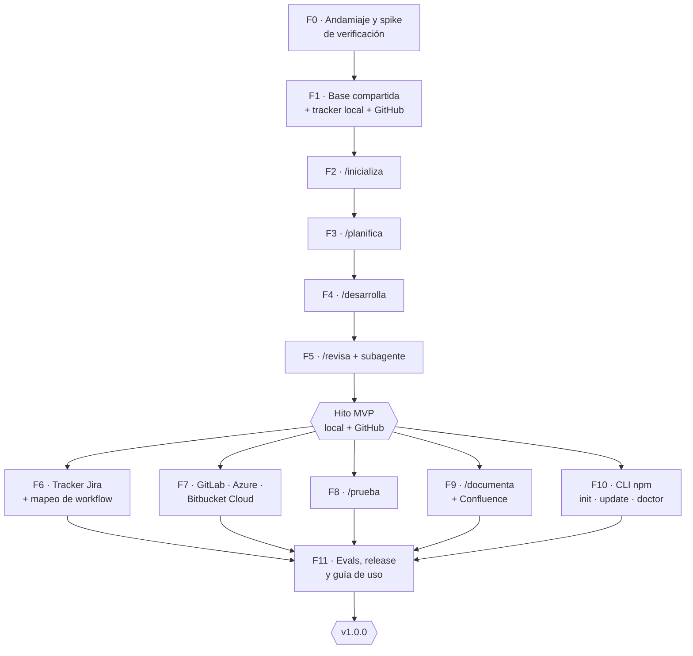

# SDD Skills — Plan de implementación

> `/sc:workflow` · 2026-10-02 · Basado en [`requisitos.md`](./requisitos.md) y [`diseno.md`](./diseno.md)
> Siguiente paso: `/sc:implement` por fases, empezando por la F0

## 1. Estrategia

**Primero un corte vertical y después se amplía.** Antes de añadir Jira, más hostings u otras skills, el flujo principal debe funcionar de principio a fin con la combinación más sencilla:

> **MVP = modo local + GitHub:** `/inicializa → /planifica → /desarrolla → /revisa`

¿Por qué este orden?
- El modo local no necesita Atlassian, así que valida el diseño de skills, protocolo, plantillas e informes sin dependencias externas.
- GitHub (`gh`) es el adaptador con mejor CLI y sirve de patrón para los otros tres.
- El protocolo común se pone a prueba cuanto antes con skills reales (D2, P2).
- Jira, los demás hostings, `/prueba`, `/documenta` y el CLI de npm son **ampliaciones independientes** que pueden avanzar en paralelo una vez cerrado el MVP.

## 2. Mapa de fases y dependencias

F6 a F10 **no dependen entre sí** y se pueden hacer en cualquier orden o en paralelo. F9 depende de F6 solo en la parte de vincular las páginas de Confluence a la historia.

## 3. Prerrequisitos (antes de empezar o al llegar a la fase indicada)

| # | Prerrequisito | Necesario en | Responsable |
|---|---|---|---|
| R1 | Nombre de la organización de GitHub y scope npm (`@org`) | F0 | Responsable del paquete |
| R2 | Designar al **responsable único** del paquete | F0 | Dirección técnica |
| R3 | Repo GitHub de pruebas (sandbox) con un proyecto Node mínimo | F1 | Dev |
| R4 | Proyecto Jira de pruebas con épica, historia, bug y story points | F6 | Admin Jira |
| R5 | Repos sandbox en GitLab, Azure DevOps y Bitbucket Cloud, con sus credenciales | F7 | Dev |
| R6 | Espacio Confluence de pruebas | F9 | Admin Confluence |
| R7 | Permiso para publicar en GitHub Packages (PAT o `GITHUB_TOKEN` con `write:packages`) | F10/F11 | Responsable del paquete |
| R8 | Proyecto Java mínimo para las evals multi-stack | F11 | Dev |

## 4. Fases

### F0 · Andamiaje y spike de verificación

**Objetivo:** dejar el repo creado y confirmar en la práctica los supuestos de Claude Code de los que depende el diseño.

| ID | Tarea | Salida |
|---|---|---|
| F0.1 | `git init`, `.gitignore`, `README.md`, `CHANGELOG.md`, licencia interna | Repo base |
| F0.2 | `package.json` (`@org/sdd-skills`, `bin: sdd`, `files`, `publishConfig` hacia GitHub Packages, `engines.node`) | Manifiesto npm |
| F0.3 | `.claude-plugin/plugin.json` (`name: sdd`) y `marketplace.json` (`source: "./"`) | Manifiestos del plugin |
| F0.4 | `scripts/build.mjs`: copia `src/skills/*` a `skills/*` e incluye los ficheros de `src/shared/` listados en `shared.txt` | Build |
| F0.5 | `scripts/build.mjs --check`: termina con error si `skills/` no coincide con el build | Verificación de deriva |
| F0.6 | **Spike:** skill `hola` con `disable-model-invocation`, `argument-hint` y una referencia relativa; instalarla como plugin desde un path local | Informe del spike |
| F0.7 | Workflow de CI con `build --check` y validación del frontmatter | `ci.yml` |

**El spike (F0.6) tiene que confirmar:**
- [x] La invocación con namespace `/sdd:hola` funciona y se pasan los argumentos.
- [x] `disable-model-invocation: true` impide que la skill se active sola.
- [x] Desde `SKILL.md` se pueden leer referencias relativas en `referencias/` y `plantillas/`.
- [x] La misma carpeta copiada a `.claude/skills/hola/` se invoca como `/hola`.
- [x] `claude plugin eval` está disponible y conocemos su formato.

**✅ Checkpoint F0 (completado 2026-10-02, ver [spike-f0.md](./spike-f0.md)):** el build es reproducible, la CI está en verde y los cinco puntos del spike están confirmados. Si alguno falla, se actualiza `diseno.md` antes de seguir.

---

### F1 · Base compartida, tracker local y GitHub

**Objetivo:** escribir el contenido que comparten todas las skills, con los dos primeros adaptadores.

| ID | Tarea | Salida |
|---|---|---|
| F1.1 | `shared/protocolo-comun.md`: arranque, **fusión de config global y repo**, funcionamiento sin config de repo, detección de modo (incluido `local-degradado`) y resolución de plantillas repo → global → skill (§5.1, §7.3) | Protocolo |
| F1.2 | `shared/informe.md`: formato común con frontmatter (§7.4) | Formato de informe |
| F1.3 | `shared/convenciones/ramas.md`: presets gitflow, github-flow y trunk, con regex de validación | Convención de ramas |
| F1.4 | `shared/convenciones/commits.md`: `tipo(CLAVE): desc`, tipos y ejemplos | Convención de commits |
| F1.5 | `shared/convenciones/dor-dod.md`: DoR y DoD estándar (requisitos §6) | DoR/DoD |
| F1.6 | `shared/contratos/tracker.md` y `git-host.md`: operaciones, entradas y salidas esperadas | Contratos |
| F1.7 | `shared/adaptadores/tracker-local.md`: formato de `specs/HU-xxx.md`, asignación de IDs y estados | Adaptador local |
| F1.8 | `shared/adaptadores/git-github.md`: recetas `gh` para las 6 operaciones y detección por la URL del remoto | Adaptador GitHub |
| F1.9 | `cli/schema/config.schema.json` (válido para los dos niveles) y la plantilla `config.yml` (§5) | Esquema de config |

**✅ Checkpoint F1** (contenido y tests completados el 2026-10-02; falta la prueba manual en el sandbox):
- Una historia de ejemplo en `specs/` valida contra el formato.
- Las recetas de GitHub se han probado a mano sobre el sandbox R3: crear PR, leer el diff, comentar en línea y consultar el estado de CI.
- Una config de ejemplo pasa el esquema.

---

### F2 · `/inicializa`

| ID | Tarea | Requisito |
|---|---|---|
| F2.1 | `SKILL.md`: flujo §8.1, con confirmación antes de escribir | RF-I1…I6 |
| F2.2 | `referencias/deteccion-stack.md`: Node, Java (Maven y Gradle), Python, .NET, Go; cómo deducir lint y tests | RF-I1 |
| F2.3 | Detección del hosting por la URL del remoto (4 patrones) | RF-I1 |
| F2.4 | Comprobación de dependencias (`command -v`, variables de entorno, Playwright, MCP de navegador) | RF-I4 |
| F2.5 | Idempotencia: si la config existe, mostrar los cambios como diff | RF-I5 |
| F2.6 | Propuesta de entradas en `.gitignore` (`.sdd/specs/`, `.sdd/reports/`) | RF-T6 |
| F2.8 | Leer la global como valores propuestos y escribir la config del repo materializada; `/inicializa --global` | RF-I5, RF-I7, D12 |
| F2.7 | Rama Atlassian **solo como stub** ("detectado, se configurará en F6"); de momento siempre `local` | — |

**✅ Checkpoint F2:**
- En el sandbox Node y en uno Java genera una config válida contra el esquema.
- Volver a ejecutarla no cambia nada si no hay cambios.
- Genera el informe `_init`.

---

### F3 · `/planifica` (modo local)

| ID | Tarea | Requisito |
|---|---|---|
| F3.1 | `SKILL.md`: máquina de estados de refinamiento §8.2, con un máximo de rondas | RF-P1 |
| F3.2 | `referencias/invest.md`: rúbrica de pasa, aviso o falla con criterios objetivos | RF-P3 |
| F3.3 | `referencias/gherkin.md` y `ejemplos.md`: buenas y malas historias, y criterios verificables | RF-P2 |
| F3.4 | `referencias/estimacion.md`: Fibonacci, razonamiento y regla de dividir si pasa de 8 | RF-P2, P4 |
| F3.5 | Plantillas `historia.md` y `epica.md` | RF-P2 |
| F3.6 | Persistencia mediante `tracker-local` | RF-P5 |
| F3.7 | Informe de planificación | RF-P6 |

**✅ Checkpoint F3:**
- A partir de 3 ideas de prueba (simple, ambigua y demasiado grande) genera historias que cumplen la DoR.
- La idea demasiado grande se divide.
- La idea ambigua provoca preguntas al PO.

---

### F4 · `/desarrolla` (local + GitHub)

| ID | Tarea | Requisito |
|---|---|---|
| F4.1 | `SKILL.md`: flujo §8.3 con los puntos de confirmación | RF-D1…D8 |
| F4.2 | `referencias/plan-tecnico.md` y la plantilla `plan.md` (tareas, mapeo con los criterios, archivos afectados) | RF-D2 |
| F4.3 | Creación y validación de la rama con el preset | RF-D3, T3 |
| F4.4 | Bucle por tarea: implementación, tests y commit convencional | RF-D4 |
| F4.5 | Verificación final con un máximo de 3 intentos de corrección; si sigue fallando, se bloquea sin crear el PR | RF-D5 |
| F4.6 | `referencias/checklist-cierre.md`: criterios y DoD con evidencia | RF-D6 |
| F4.7 | Plantilla `pr.md` con el checklist incluido y creación del PR con `git-github` | RF-D7 |
| F4.8 | Reanudación: plan y rama existentes → continuar desde la primera tarea sin commit | §8.3 |

**✅ Checkpoint F4:**
- En el sandbox, una historia de 3 puntos termina en un PR real con la rama y los commits bien nombrados y el checklist en la descripción.
- Si se fuerza un test roto, **no** se crea el PR.
- Interrumpir la ejecución y relanzarla la reanuda donde estaba.

---

### F5 · `/revisa` y subagente

| ID | Tarea | Requisito |
|---|---|---|
| F5.1 | `SKILL.md`: flujo §8.4 | RF-R1…R5 |
| F5.2 | `referencias/checklist-revision.md` por dimensión | RF-R2 |
| F5.3 | `referencias/severidades.md` y `tono-comentarios.md` | RF-R3 |
| F5.4 | `agents/sdd-revisor-dimension.md` con formato de salida estructurado | §8.4 |
| F5.5 | Umbral de diff para lanzar subagentes (configurable) y consolidación de hallazgos | D5 |
| F5.6 | Selección interactiva de comentarios y publicación en línea con `git-github` | RF-R4 |
| F5.7 | Deduplicación contra los comentarios existentes | RNF-5 |
| F5.8 | Informe con la matriz criterio → evidencia | RF-R5 |

**✅ Checkpoint F5:**
- Sobre el PR de F4, y sobre otro con fallos sembrados (secreto en el código, criterio sin cubrir, commit mal nombrado), detecta todos los fallos sembrados.
- Solo publica los comentarios seleccionados.
- Volver a ejecutarla no duplica comentarios.

---

### 🏁 Hito MVP

**Criterio de salida:** un desarrollador ajeno al proyecto ejecuta todo el flujo `/sdd:inicializa → planifica → desarrolla → revisa` en el sandbox de GitHub siguiendo solo la guía rápida, sin ayuda. Su feedback se incorpora antes de seguir con las ampliaciones.

Se etiqueta como `v0.1.0` (pre-release interna) y se instala desde el marketplace local.

---

### F6 · Tracker Jira

| ID | Tarea | Requisito |
|---|---|---|
| F6.1 | `adaptadores/tracker-jira.md`: recetas MCP para cada operación del contrato (`vincular` = no-op, D10) | §6.1 |
| F6.2 | `/inicializa`: elegir sitio, proyecto y espacio; leer las transiciones; mapear los estados; localizar el campo de story points | RF-I3 |
| F6.3 | `/inicializa`: detectar la integración hosting↔Jira y avisar si falta | D10 |
| F6.4 | Modo `local-degradado` y bloqueo de las skills que escriben (D6) | RF-T2 |
| F6.5 | `/planifica`: épica, historias con `parent`, puntos y vínculos de dependencia | RF-P5 |
| F6.6 | `/desarrolla`: transiciones a *en curso* y *en revisión* | RF-D3, D7 |
| F6.7 | Idempotencia: buscar antes de crear para no duplicar historias | RNF-5 |

**✅ Checkpoint F6:**
- Flujo completo contra el proyecto Jira R4.
- Con el MCP desconectado, `/planifica` se detiene y `/revisa` sigue funcionando.
- El PR aparece en el panel de desarrollo de la issue.

---

### F7 · GitLab, Azure DevOps y Bitbucket Cloud

Las tres subfases son independientes entre sí.

| ID | Tarea | Notas |
|---|---|---|
| F7.1 | `git-gitlab.md`: `glab` y discussions con `position` | — |
| F7.2 | `git-azure.md`: `az repos` + `az devops invoke` para los threads (D9) | Confirmar los parámetros `area`/`resource` |
| F7.3 | `git-bitbucket-cloud.md`: REST 2.0 con `curl`, Basic `BITBUCKET_EMAIL:BITBUCKET_API_TOKEN` | Comentarios en línea con `inline.to` |
| F7.4 | Registrar en `cli/versiones-minimas.json` la versión de cada CLI probada | D11 |

**✅ Checkpoint F7:** en cada sandbox R5, `/desarrolla` crea el PR o MR y `/revisa` publica un comentario en línea en el sitio correcto.

---

### F8 · `/prueba`

| ID | Tarea | Requisito |
|---|---|---|
| F8.1 | `SKILL.md`: flujo §8.5 | RF-E1…E5 |
| F8.2 | Plantilla `caso-e2e.md`: derivación desde los escenarios Gherkin | RF-E1 |
| F8.3 | `referencias/exploratoria-mcp.md`: Playwright MCP y Claude in Chrome, elección `auto`, evidencias | RF-E2 |
| F8.4 | `referencias/playwright-generacion.md`: convenciones de nombres, selectores accesibles y ofrecer instalarlo si falta | RF-E3 |
| F8.5 | Comprobar que la URL base responde antes de empezar | §8.5 |
| F8.6 | Plantilla `bug.md` y `crearBug` con confirmación | RF-E4 |

**✅ Checkpoint F8:**
- Sobre la app del sandbox, los escenarios de una historia se ejecutan en el navegador con capturas.
- Se generan tests Playwright que pasan en CI.
- Un fallo sembrado produce un bug bien formado.

---

### F9 · `/documenta` y Confluence

| ID | Tarea | Requisito |
|---|---|---|
| F9.1 | `SKILL.md`: flujo §8.6 | RF-O1…O5 |
| F9.2 | `referencias/mapa-documental.md`: tipo de cambio → documento | RF-O1 |
| F9.3 | Plantillas `doc-tecnica.md`, `adr.md` y `changelog.md` | RF-O2 |
| F9.4 | Detección de documentación obsoleta (búsqueda de símbolos y rutas modificados en `docs/`) | RF-O3 |
| F9.5 | `referencias/confluence.md`: buscar por título y crear o actualizar bajo `pagina_padre` | RF-O4 |

**✅ Checkpoint F9:**
- Un endpoint nuevo genera la actualización de la doc de API y una entrada en el changelog.
- Una ruta renombrada se detecta como documentación obsoleta.
- La página de Confluence se actualiza sin duplicarse.

---

### F10 · CLI npm

| ID | Tarea | Requisito |
|---|---|---|
| F10.1 | `sdd init [--global]`: copia a `.claude/skills/` o `~/.claude/skills/` y crea el manifiesto con hashes | §4, D12 |
| F10.2 | `sdd update`: reemplaza los ficheros que el usuario no ha tocado y avisa de los modificados | RNF-3 |
| F10.3 | `sdd doctor`: esquema de las dos configs, config efectiva con el origen de cada clave, instalación duplicada (plugin + npm, global + repo), CLIs, variables de entorno y versiones mínimas | §4, D11 |
| F10.4 | Tests del CLI (node:test) | §10 |
| F10.5 | Documentar `.npmrc` para GitHub Packages | RNF-2 |

**✅ Checkpoint F10:**
- `npm i -D` desde GitHub Packages seguido de `npx sdd init` deja `/inicializa` disponible.
- Si se modifica un fichero a mano, `update` lo respeta.
- `doctor` detecta una instalación duplicada.

---

### F11 · Evals, release y guía de uso

| ID | Tarea |
|---|---|
| F11.1 | `evals/`: casos por skill (al menos 3 por skill, incluidos casos negativos) con `claude plugin eval` |
| F11.2 | Evals por hosting contra los 4 sandboxes (D11) |
| F11.3 | Proyecto Java en las evals (R8) |
| F11.4 | `scripts/release.mjs` (sincroniza versiones) y `release.yml` (tag → GitHub Packages) |
| F11.5 | Protección de tags: solo el responsable único |
| F11.6 | `docs/guia-uso.md`: instalación por los dos canales, guía rápida, referencia de la config, personalización de plantillas y FAQ |
| F11.7 | `docs/guia-mantenedor.md`: añadir un adaptador o una skill, ejecutar las evals, publicar una versión |

**✅ Checkpoint F11 → `v1.0.0`:**
- Todas las evals en verde.
- La release publicada en GitHub Packages y en el marketplace.
- Un equipo piloto lo instala y lo usa con una historia real.

## 5. Matriz de trazabilidad (requisito → fase)

| Requisitos | Fase |
|---|---|
| RF-T1, T3, T4, T5, T7, T9 | F1 |
| RF-T2 (degradado), RF-I3 | F6 |
| RF-T6, RF-I1…I6 | F2 (+F6 para Atlassian) |
| RF-T8 | F1 (GitHub) + F7 (el resto) |
| RF-P1…P6 | F3 (+F6 para Jira) |
| RF-D1…D8 | F4 (+F6 para las transiciones) |
| RF-R1…R5 | F5 |
| RF-E1…E5 | F8 |
| RF-O1…O5 | F9 |
| RNF-1, 7, 8 | F0–F1 (arquitectura) |
| RNF-2, 3 | F10, F11 |
| RNF-4 | F1 (esquema sin secretos), F7 (variables de entorno) |
| RNF-5 | F2, F5, F6, F9 |
| RNF-6 | F4 + F6 (D10) |

## 6. Riesgos del plan

| Riesgo | Impacto | Mitigación |
|---|---|---|
| El spike F0 contradice un supuesto (namespace, referencias relativas, evals) | Alto: cambia el diseño | Se hace **antes** de escribir contenido; si falla, se actualiza el diseño |
| `/desarrolla` es la skill más compleja y la más propensa a desviarse del plan | Alto | Checkpoint F4 estricto con casos de fallo forzado; DoR ≤ 8 puntos |
| Los sandboxes R4–R6 tardan en estar disponibles | Medio: bloquea F6, F7 y F9 | Pedirlos al inicio del proyecto; F8 y F10 no los necesitan |
| La calidad de las respuestas varía entre ejecuciones | Medio | Evals con varias ejecuciones por caso y rúbricas objetivas (INVEST, matriz de criterios) |
| Las recetas de Azure (D9) necesitan parámetros poco documentados | Bajo | Si `az devops invoke` resulta demasiado frágil, recurrir a PAT + `curl` (alternativa recogida en D9) |

## 7. Orden de ejecución recomendado con `/sc:implement`

1. `F0` → validar el spike → `F1`
2. `F2` → `F3` → `F4` → `F5` → **hito MVP (v0.1.0)**
3. En paralelo o en el orden que convenga: `F6` (más valor para equipos con Jira) → `F7` → `F10` → `F8` → `F9`
4. `F11` → **v1.0.0**
